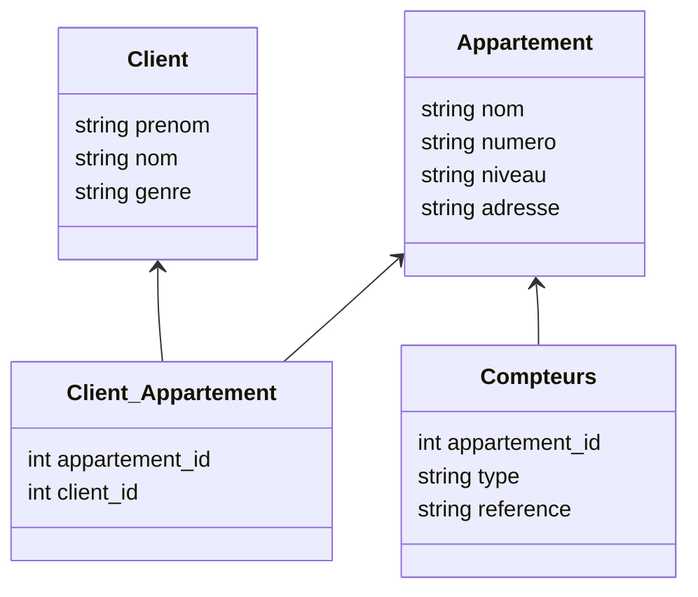

# Diagramme

```mermaid
classDiagram

class Client{
    string prenom
    string nom
    string genre
}

Client <-- Client_Appartement
Appartement <-- Client_Appartement
Appartement <-- Compteurs

class Appartement{
    string nom
    string numero
    string niveau
    string adresse
}

class Compteurs{
    int appartement_id
    string type
    string reference
}

class Client_Appartement{
    int appartement_id
    int client_id
}


```
