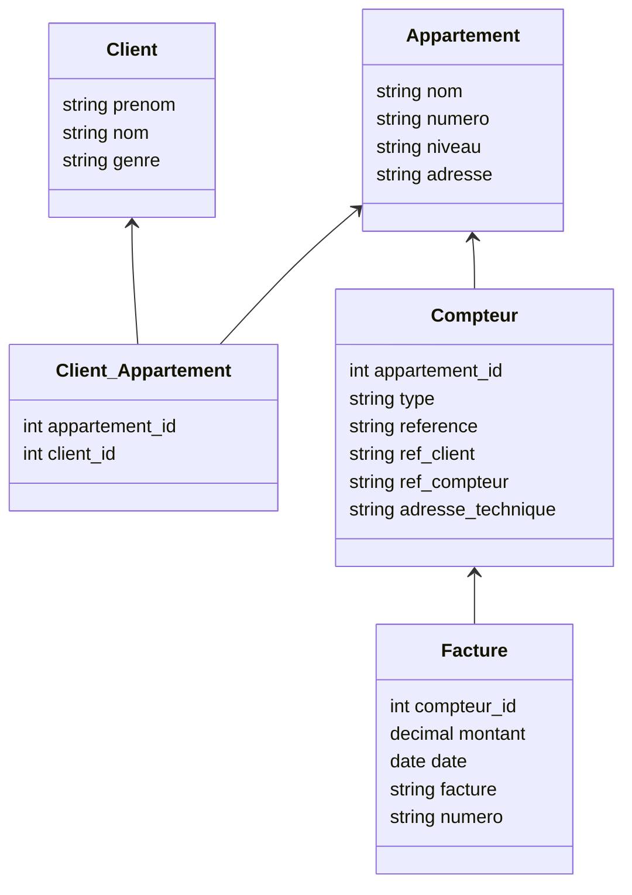

# Diagramme

```mermaid
classDiagram

class Client{
    string prenom
    string nom
    string genre
}

Client <-- Client_Appartement
Appartement <-- Client_Appartement
Appartement <-- Compteur
Compteur <-- Facture

class Appartement{
    string nom
    string numero
    string niveau
    string adresse
}

class Compteur{
    int appartement_id
    string type
    string reference
    string ref_client
    string ref_compteur
    string adresse_technique
}

class Client_Appartement{
    int appartement_id
    int client_id
}

class Facture{
    int compteur_id
    decimal montant
    date date
    string facture
    string numero
}


```
